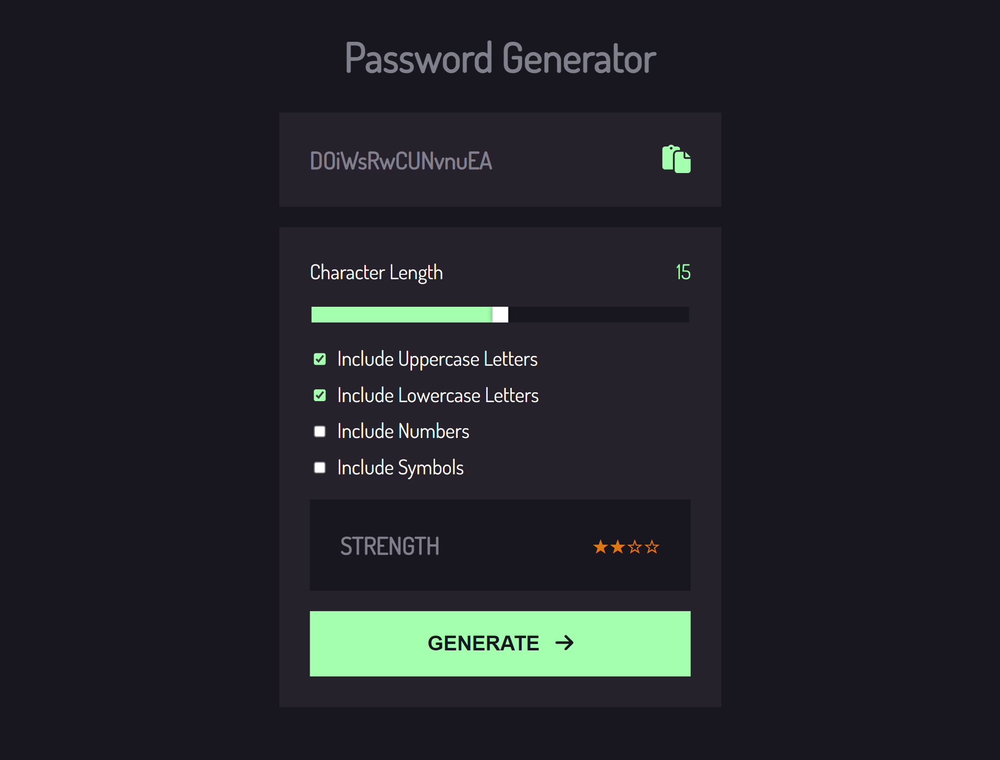

# password-generator

This is a solution to the [Password generator app](https://www.frontendmentor.io/challenges/password-generator-app-Mr8CLycqjh). Frontend Mentor challenges help you improve your coding skills by building realistic projects. 

## Screenshot



## Links

- [demo](https://cstnaya.github.io/password-generator)
- [Github repo](https://github.com/cstnaya/password-generator)

## Built with

- ESLint - For coding styles
- Fort-awesome - icons
- Generate-Password-Browser - A 3rd party packages for generating password
- Pinia - For managing global states
- Prettier - For coding styles
- Vite
- Vitest + Vue Test Utils + JSDom - For testing
- Sass - For styles (CSS-preprocessor)
- Vue3 - JS Library

## What I learned

1. Syntax of composition API: `ref`, `reactive`, `computed`, `defineProps`, `emit`
2. use stores by **Pinia** in composition syntax: `defineStore`, `useStateStore`, `storeToRefs`
    - [watch this video to know how to get start using pinia](https://vueschool.io/lessons/access-state-from-a-pinia-store)
3. make rwd layouts
4. change browser default component styles, like: `input-range-slider` and `checkbox`
    - [how to change checkbox color](https://stackoverflow.com/a/69057542)
    - [how to change range slider color](https://stackoverflow.com/a/38163892)
5. use scss variables in global vue project
6. use scss styles in global vue project
   - [How to use scss in global whole project](https://ithelp.ithome.com.tw/articles/10301528)
7. [how to copy text to browser clipboard](https://www.w3schools.com/howto/howto_js_copy_clipboard.asp)
    ```javascript
    navigator.clipboard.writeText("text-here");
    ```
8. use testing tools for testing vue component
9.  deploying on github action
    - [how to use github action](https://github.com/marketplace/actions/deploy-to-github-pages)
10. vue unit test (todo)

## Deploy
This website is deployed on Github pages by Github action. [Learn how to use](https://github.com/marketplace/actions/deploy-to-github-pages).

## Useful Resources

1. [Frontend Mentor - password generator app](https://www.frontendmentor.io/challenges/password-generator-app-Mr8CLycqjh)
1. [How to use Github CD for github pages.](https://github.com/marketplace/actions/deploy-to-github-pages)
2. [Vue school - how to access pinia states in components.](https://vueschool.io/lessons/access-state-from-a-pinia-store)
3. [Vue3 composition API - ref or reactive, which one to choose?](https://vueschool.io/lessons/access-state-from-a-pinia-store)
4. [remove vue-eslint multi word component naming rules.](https://eslint.vuejs.org/rules/multi-word-component-names.html)
5. [Pinia Official Guide - how to get start to use store.](https://pinia.vuejs.org/core-concepts/)
6. [How to use scss in global whole project.](https://ithelp.ithome.com.tw/articles/10301528)
7. [Conquering Responsive Layouts - tutorial to teach you how to create a RWD website.](https://courses.kevinpowell.co/view/courses/conquering-responsive-layouts)

## Project Setup

```sh
npm install
```

### Compile and Hot-Reload for Development

```sh
npm run dev
```

### Compile and Minify for Production

```sh
npm run build
```

### Run Unit Tests with [Vitest](https://vitest.dev/)

```sh
npm run test:unit
```

### Lint with [ESLint](https://eslint.org/)

```sh
npm run lint
```

## Recommended IDE Setup

[VSCode](https://code.visualstudio.com/) + [Volar](https://marketplace.visualstudio.com/items?itemName=Vue.volar) (and disable Vetur) + [TypeScript Vue Plugin (Volar)](https://marketplace.visualstudio.com/items?itemName=Vue.vscode-typescript-vue-plugin).
